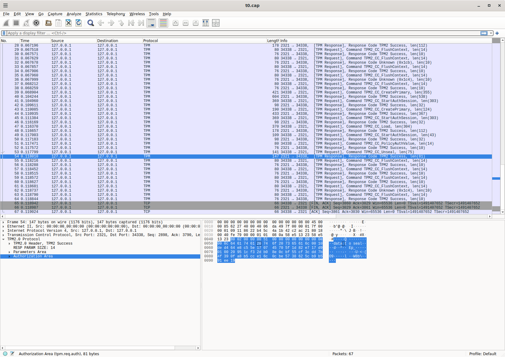
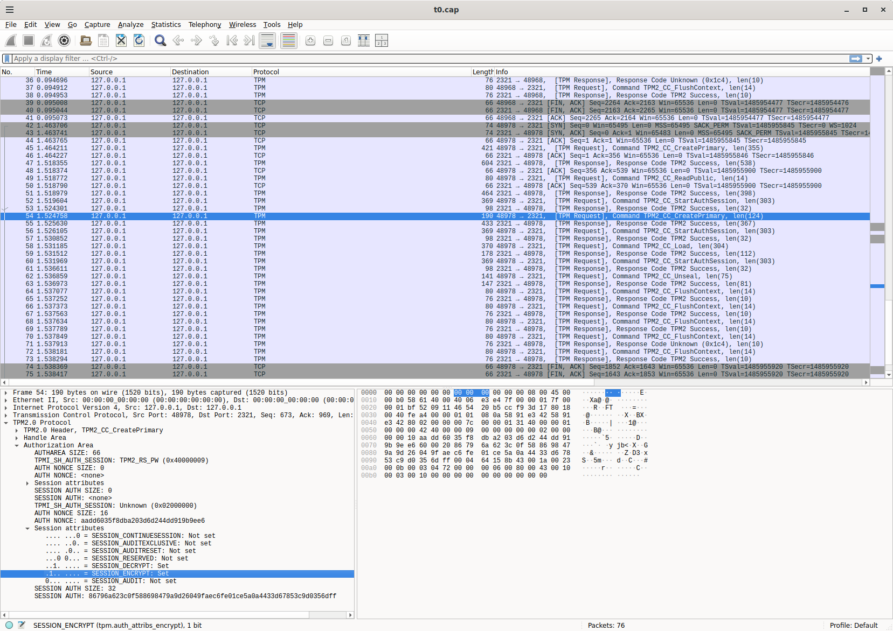
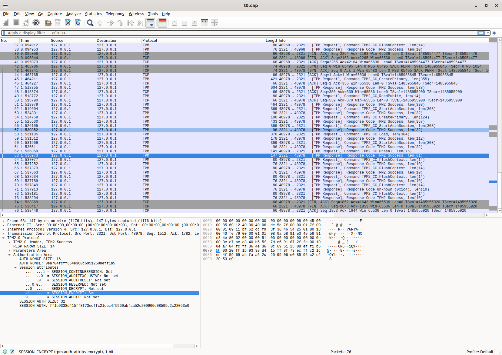

## TPM Seal/Unseal with Policy

CLI and golang library to seal and unseal data to a TPM with PCR or AuthValue (password) policies.

Basically, you can take data upto 128bytes, encode it directly into a TPM object such that it can only get conditionally decoded on that same TPM.

The conditions supported are PCRValues and Passwords meaning the data will only unseal if certain passphrase or PCR values are present on the TPM.

see

- [tpm2_unseal](https://github.com/tpm2-software/tpm2-tools/blob/master/man/tpm2_unseal.1.md)

Once unsealed, the data is visible to the application.  If you need to encrypt large amounts of data, you can seal an AES key into the TPM itself.

You can use this as a cli or as a library

If you want to actually transfer an arbitrary key from a remote system such that the is never actually exposed, see

- [tpmcopy: Transfer RSA|ECC|AES|HMAC key to a remote Trusted Platform Module (TPM)](https://github.com/salrashid123/tpmcopy)
- [TINK Go TPM extension](https://github.com/salrashid123/tink-go-tpm)
- [AEAD encryption using Trusted Platform Module (TPM)](https://github.com/salrashid123/go-tpm-wrapping)

>> note this repo is not supported by google

---

* [Overview](#overview)
* [Options](#options)
* [References](#references)
* [Build](#build)
* [Usage CLI](#usage-cli)
  - [CLI No Policy](#cli-no-policy)
  - [CLI Password Policy](#cli-password)
  - [CLI PCR Policy](#cli-pcr-policy)
* [Usage Library](#usage-library)
  - [Library No Policy](#library-no-policy)
  - [Library Password Policy](#library-password)
  - [Library PCR Policy](#library-pcr-policy)  
* [Key Parent](#key-parent)
* [Session Encryption](#session-encryption)
* [Unseal with python](#unseal-with-python)
* [Unseal with tpm2_tools](#unseal-with-tpm2_tools)
* [TPMPolicy Syntax PEM Encoding](#tpmpolicy-syntax-pem-encoding)

---

### Overview

Sealing and Unsealing allows you to encode some small arbitrary data like an AES key into a TPM object.  Once sealed, the key is encrypted by that TPM alone and cannot get decoded on any other TPM or system.   You can specify PCR or password policies to the key which means the system which has the TPM to decode the key mush be in a specific PCR state and/or the user must provide a passphrase to decyrpt.

This library binds the tpm object using session policies. You must initialize a session even if no policies are set.  In other words, all keys have `UserWithAuth:  false`


### Options

| Option | Description |
|:------------|-------------|
| **`-tpm-path`** | Path to the TPM device (default: `/dev/tpmrm0`) |
| **`-mode`** | Operation mode: `mode of operation: seal or unseal` (default: ``) |
| **`-parentKeyType`** | Type of parent key to use `rsa_ek|ecc_ek|rsa_srk|ecc_srk|h2 (default h2)` |
| **`-secret`** | secret to seal  (default: `""`) |
| **`-pcrValues`** | comma separated list of current pcr values to bind the key to (default: "") |
| **`-password`** | passphrase for the TPM key (default: "") |
| **`-ownerpw`** | passphrase for the TPM owner (default: "") |
| **`-out`** | Output file to write the sealed PEM file to  (default: `""`) |

---

### References

- [tpm2 key utility](https://github.com/salrashid123/tpm2genkey)
- [go-tpm-keyfiles.sealed_data](https://github.com/Foxboron/go-tpm-keyfiles?tab=readme-ov-file#sealed-data)

### Build

You can use the binary in the [Releases](https://github.com/salrashid123/tpmseal/releases) page as a standalone cli or load as a library or just build: 

```bash
go build -o tpmseal cmd/main.go
```

---

### Usage CLI

If you just want to get started, you can use a [software tpm](https://github.com/stefanberger/swtpm).  If you want to use a real TPM, specify its device (eg `--tpm-path=/dev/tpmrm0`)

Start the `swtpm` on port `2321`.  You'll also want to install [tpm2_tools](https://github.com/tpm2-software/tpm2-tools)

```bash
rm -rf /tmp/myvtpm && mkdir /tmp/myvtpm && \
   swtpm_setup --tpmstate /tmp/myvtpm --tpm2 --create-ek-cert && \
   swtpm socket --tpmstate dir=/tmp/myvtpm --tpm2 --server type=tcp,port=2321 --ctrl type=tcp,port=2322 --flags not-need-init,startup-clear --log level=2
```

In a new window, export some environment variables and seal/unseal data using various parent key types.  The following uses the `H2` parent key 

#### CLI No Policy

```bash
export TPM2TOOLS_TCTI="swtpm:port=2321"

## no password
tpmseal --mode=seal --secret="data to seal" --parentKeyType=h2 --tpm-path="127.0.0.1:2321" --out=/tmp/private.pem
tpmseal --mode=unseal --key=/tmp/private.pem --parentKeyType=h2 --tpm-path="127.0.0.1:2321" --out=/tmp/plaintext.txt
```

#### CLI Password Policy

```bash
## password
tpmseal --mode=seal --secret="data to seal" --password=bar --parentKeyType=h2 --tpm-path="127.0.0.1:2321" --out=/tmp/private.pem
tpmseal --mode=unseal --password=bar --key=/tmp/private.pem --parentKeyType=h2 --tpm-path="127.0.0.1:2321" --out=/tmp/plaintext.txt
```

#### CLI PCR Policy

First setup a PCR policy and read its value.  In the following, the default pcr back 23 is exended and that is used to seal/unseal.

If the pcr values differ from what it was when it was sealed, the key will not decode.

```bash
tpm2_pcrextend 23:sha256=0x0000000000000000000000000000000000000000000000000000000000000000
tpm2_pcrread sha256:23
  sha256:
    23: 0xF5A5FD42D16A20302798EF6ED309979B43003D2320D9F0E8EA9831A92759FB4B

tpmseal --mode=seal --secret="data to seal" \
   --pcrValues=23:F5A5FD42D16A20302798EF6ED309979B43003D2320D9F0E8EA9831A92759FB4B \
    --parentKeyType=h2 --tpm-path="127.0.0.1:2321" --out=/tmp/private.pem

tpmseal --mode=unseal --pcrValues=23:F5A5FD42D16A20302798EF6ED309979B43003D2320D9F0E8EA9831A92759FB4B \
    --key=/tmp/private.pem --parentKeyType=h2 --tpm-path="127.0.0.1:2321" --out=/tmp/plaintext.txt
```

---

### Usage Library

You can also seal/unseal in golang as a library

THe basic form is 

```golang
	b, err := tpmseal.Seal(&tpmseal.SealConfig{
		TPMConfig: tpmseal.TPMConfig{
			TPMPath: *tpmPath,
		},
		Parent: tpmseal.H2,
		Key:    []byte(*key),
	})

	fmt.Printf("Sealed Key: \n%s\n", string(b))

	r, err := tpmseal.Unseal(&tpmseal.UnSealConfig{
		TPMConfig: tpmseal.TPMConfig{
			TPMPath: *tpmPath,
		},
		Parent: tpmseal.H2,
		Key:    b,
	})

	fmt.Printf("unsealed Key: \n%s\n", string(r))
```

Each of the samples below does the following

1. connect to a TPM
2. seal a secret and save the key as a PEM file
3. read the pem file and decrypt the secret

#### Library No Policy

```bash
$ go run no_policy/main.go -key="data to seal" --pemFile=/tmp/private.pem --tpm-path="127.0.0.1:2321"
Sealed Key: 
-----BEGIN TSS2 PRIVATE KEY-----
MIH0BgZngQUKAQOgAwEB/wIEQAAAAQRQAE4ACAALAAAAEgAgAAAAAAAAAAAAAAAA
AAAAAAAAAAAAAAAAAAAAAAAAAAAAEAAgtz1I6YTszaDVwn2uZbMBR67ti+gTPP0M
8WFjGCSGJDQEgYwAigAg/UfbOHF+pAd5rAStAllzZKEv/q1n71Nyvx/JIDweVVMA
EAzA1fSpWC1Z/KSUuM/vU+Fgs7pclLWJjGprn8vF0CkN9zB3TgbaWGsETO+UT46M
iKHjbW9M3sHqmyIH2T74sC6XjADkMbP8biyvHB17Tj3f5zylSfDOQnRdVApBq6YU
5KJmyZy5aw==
-----END TSS2 PRIVATE KEY-----

unsealed Key: 
data to seal

```

#### Library Password

```bash
$ go run password/main.go --keypassword="foooo" -key="data to seal" --pemFile=/tmp/private.pem --tpm-path="127.0.0.1:2321"
Sealed Key: 
-----BEGIN TSS2 PRIVATE KEY-----
MIH/BgZngQUKAQOhDjAMMAqgBAICAWuhAgQAAgRAAAABBFAATgAIAAsAAAASACCP
zSFpq5JpTgxjPxq3coQrgkG7wgKImB/HrB7dwf3bDgAQACBg+jdk+HJXC/X2+D+W
NobhcqvldhZ6R1RAzCQZ5WL2DwSBjACKACCIzXs51sm+jfjZ0M/DhvokeJKba6P8
TQnlE/GA+vuQ+gAQUqQzNiWx10RKNB1824lPzCe1DFMgVL00FDaDOCcYLCGFMohq
wTSDTpL58wtqkqExgd0i/DOMl9icok4hMIIOGWLqIBxXf27HLl2QgA0CsB3vvFbD
/M/E3n3SrZkmB9m8G/z4hJ/Y
-----END TSS2 PRIVATE KEY-----

unsealed Key: 
data to seal
```

#### Library PCR Policy

For the PCR demo, you should extend PCR and specify the bank and value inline:

```bash
tpm2_pcrextend 23:sha256=0x0000000000000000000000000000000000000000000000000000000000000000
tpm2_pcrread sha256:23
  sha256:
    23: 0xF5A5FD42D16A20302798EF6ED309979B43003D2320D9F0E8EA9831A92759FB4B

go run pcr/main.go  --pcrValues=23:F5A5FD42D16A20302798EF6ED309979B43003D2320D9F0E8EA9831A92759FB4B \
   -key="data to seal" --pemFile=/tmp/private.pem --tpm-path="127.0.0.1:2321"

Sealed Key: 
-----BEGIN TSS2 PRIVATE KEY-----
MIIBMAYGZ4EFCgEDoAMBAf+hOjA4MDagBAICAX+hLgQsACDi9hw/cdHe/T+pmd+j
aVN1XGkGiXmZYrSL69g2l06M+QAAAAEACwMAAIACBEAAAAEEUABOAAgACwAAABIA
ICCUKJCZwssYDyj5nHHI1oESOTX3Mwva5aoa4eCfD+UyABAAIDCbfqsVIH1V6L6f
+lN22oLyfCGT5QvU1ZFtuwSE/0zrBIGMAIoAIFi0BWYa+rhhuSM7it3us1NMUACL
aYXNjv+b+YIHT08uABAIu/KmuUFA3n7/kPZWPUDIWqlq7nCviiIFvSDUga8g5L3y
5GoeGTmGfnpVRly+H78d4lQblXB4Slz47mEwZesNBIccs8af+VeZJGgY3PDO+scj
ARRM2VW5jG6tq1v2f78rioXrq2M=
-----END TSS2 PRIVATE KEY-----

unsealed Key: 
data to seal
```

### Key Parent

You can specify different parent types to use with sealing and unsealing.  If a key is using a particular key type, it must be used consistently.

The various parent types are:

```golang
const (
	RSASRK ParentType = iota // 0
	ECCSRK                   // 1
	RSAEK                    // 2
	ECCEK                    // 3
	H2                       // 4
)
```

The recommended keytype is `H2` because that is more compatible with `openssl` and the KeyFile specifications.

### Session Encryption

This library and CLI also supports [session/bus encrytpion](https://github.com/salrashid123/tpm2/tree/master/tpm_encrypted_session).

What that means is if encryption is not enabled, someone with physical access to the hardware bus can inspect the traffic.  For example, with a swtpm and wireshark, the 'unseal' data is visible in the clear



If you use the cli or library without any policies, the default `RSAEK` public key will get recalled and used.

```golang
	b, err := tpmseal.Seal(&tpmseal.SealConfig{
		TPMConfig: tpmseal.TPMConfig{
			TPMDevice:               rwc,
			SessionEncryptionHandle: createEKRsp.ObjectHandle,
		},
		Parent: tpmseal.H2,
		Key:    []byte(*key),
	})

	r, err := tpmseal.Unseal(&tpmseal.UnSealConfig{
		TPMConfig: tpmseal.TPMConfig{
			TPMDevice:               rwc,
			SessionEncryptionHandle: createEKRsp.ObjectHandle,
		},
		Parent: tpmseal.H2,
		Key:    b,
	})
```

You can specify your own by adding in the `SessionEncryptionHandle` to the seal or unseal command

If you setup any policy, you can set that there too:

```golang
	s, err := tpmseal.NewPolicyPasswordSession(rwr, []byte(*keypassword), createEKRsp.ObjectHandle)

	r, err := tpmseal.Unseal(&tpmseal.UnSealConfig{
		TPMConfig: tpmseal.TPMConfig{
			TPMDevice:               rwc,
			SessionEncryptionHandle: createEKRsp.ObjectHandle,
		},
		Parent:      tpmseal.H2,
		Key:         b,
		AuthSession: s,
	})
```

So as a demo, run either

```bash
go run session_encryption/main.go
```

you'll see that the data on the wire is encrypted both ways

- seal



- unseal




### Unseal with python

This repo also shows a small demo of using `python-tss` to read the PEM files and seal/unseal.

You can find more examples of python policies [here](https://github.com/salrashid123/tpm2/tree/master/pytss):

To use you must have a version of openssl that supports `pytss`

```bash
apt-get install libtss2-dev
virtualenv env
source env/bin/activate
python3 -m pip install tpm2-pytss
# python3 -m pip install git+https://github.com/tpm2-software/tpm2-pytss.git

python3 esap_no_policy.py
```

### Unseal with tpm2_tools

You can also unseal the object using `tpm2_tools`.  However, to do that you have to first convert the PEM key into a format `tpm2_tools` understands

First set the envionment variable pointing tpm2_tools to use the swtpm and download the conversion utility (TODO: add that feature into this library)

The following uses [tpm2genkey  Convert PEM --> [TPM2B_PUBLIC, TPM2B_PRIVATE]](https://github.com/salrashid123/tpm2genkey/tree/main?tab=readme-ov-file#convert-pem----tpm2b_public-tpm2b_private)

```bash
export TPM2OPENSSL_TCTI="swtpm:port=2321"
openssl list --providers -provider tpm2

wget https://github.com/salrashid123/tpm2genkey/releases/download/v0.8.2/tpm2genkey_0.8.2_linux_amd64 
tpm2genkey_0.8.2_linux_amd64  --mode=pem2tpm  --in=private.pem --public=key.pub --private=key.priv
```

- `No Policy`

Note that you still have to initialize an authsession with no policies set because that all keys are bound with `UserWithAuth:  false`

```golang
			ObjectAttributes: tpm2.TPMAObject{
				FixedTPM:     true,
				FixedParent:  true,
				UserWithAuth: false,
			},
```

```bash
tpm2genkey_0.8.2_linux_amd64  --mode=pem2tpm  --in=private.pem --public=key.pub --private=key.priv

## create h2 parent
printf '\x00\x00' > unique.dat
tpm2_createprimary -C o -G ecc  -g sha256  -c primary.ctx -a "fixedtpm|fixedparent|sensitivedataorigin|userwithauth|noda|restricted|decrypt" -u unique.dat

tpm2_load  -C primary.ctx -u key.pub -r key.priv -c key.ctx
tpm2_flushcontext -t
tpm2_startauthsession --policy-session -S session.dat
tpm2_unseal -c key.ctx  -p"session:session.dat"
tpm2_flushcontext -t && tpm2_flushcontext -s && tpm2_flushcontext -l
```

- `PolicyAuthValue`

```bash
tpm2genkey_0.8.2_linux_amd64  --mode=pem2tpm  --in=private.pem --public=key.pub --private=key.priv

printf '\x00\x00' > unique.dat
tpm2_createprimary -C o -G ecc  -g sha256  -c primary.ctx -a "fixedtpm|fixedparent|sensitivedataorigin|userwithauth|noda|restricted|decrypt" -u unique.dat

tpm2_load  -C primary.ctx -u key.pub -r key.priv -c key.ctx
tpm2_flushcontext -t
tpm2_startauthsession --policy-session -S session.dat
tpm2_policyauthvalue -S session.dat 
tpm2_unseal -c key.ctx  -p"session:session.dat+foooo"
tpm2_flushcontext -t && tpm2_flushcontext -s && tpm2_flushcontext -l
```

- `PolicyPCR`

```bash
# get a non-default pcr value just for this demo
tpm2_pcrextend 23:sha256=0x0000000000000000000000000000000000000000000000000000000000000000
tpm2_pcrread sha256:23
  sha256:
    23: 0xF5A5FD42D16A20302798EF6ED309979B43003D2320D9F0E8EA9831A92759FB4B

tpm2genkey_0.8.2_linux_amd64  --mode=pem2tpm  --in=private.pem --public=key.pub --private=key.priv

printf '\x00\x00' > unique.dat
tpm2_createprimary -C o -G ecc  -g sha256  -c primary.ctx -a "fixedtpm|fixedparent|sensitivedataorigin|userwithauth|noda|restricted|decrypt" -u unique.dat

tpm2_load  -C primary.ctx -u key.pub -r key.priv -c key.ctx
tpm2_flushcontext -t
tpm2_startauthsession --policy-session -S session.dat
tpm2_policypcr -S session.dat -l sha256:23 
tpm2_unseal -c key.ctx  -p"session:session.dat"
tpm2_flushcontext -t && tpm2_flushcontext -s && tpm2_flushcontext -l
```

### TPMPolicy Syntax PEM Encoding

If you want to encode the policies into the PEM file based on the __draft__ [ASN.1 Specification for TPM 2.0 Key Files](https://www.hansenpartnership.com/draft-bottomley-tpm2-keys.html#name-key-policy-specification), then set `ENABLE_POLICY_SYNTAX` environment variable to any value during the duplicate and import steps.

Please note that it the specs are still draft and is incompatible with the PEM format used by openssl

Anyway, the big advantage of this encoding is the PEM file describes the steps to generate the policy itself and execute them.

For example, see the link here on how to [manually generate](https://github.com/salrashid123/tpm2/tree/master/policy_gen) the policies and  use [policySyntax utility](https://github.com/salrashid123/tpm2genkey/tree/main?tab=readme-ov-file#policy-command-parameters).

In the following note that the same codebase will execute the both types of policies and add them into the PEM.

Note that the command code for  `TPMCCPolicyAuthValue=0x0000016B`, `TPMCCPolicyPCR=0x0000017F`

```bash
$ export ENABLE_POLICY_SYNTAX=1
$ go run cmd/main.go --mode=seal --secret="data to seal" \
     --pcrValues=23:F5A5FD42D16A20302798EF6ED309979B43003D2320D9F0E8EA9831A92759FB4B  --password=bar \
       --parentKeyType=h2 --tpm-path="127.0.0.1:2321" --out=/tmp/private.pem

$ openssl asn1parse -in /tmp/private.pem 
    0:d=0  hl=4 l= 311 cons: SEQUENCE          
    4:d=1  hl=2 l=   6 prim: OBJECT            :2.23.133.10.1.3
   12:d=1  hl=2 l=  70 cons: cont [ 1 ]        
   14:d=2  hl=2 l=  68 cons: SEQUENCE          
   16:d=3  hl=2 l=  54 cons: SEQUENCE          
   18:d=4  hl=2 l=   4 cons: cont [ 0 ]        
   20:d=5  hl=2 l=   2 prim: INTEGER           :017F
   24:d=4  hl=2 l=  46 cons: cont [ 1 ]        
   26:d=5  hl=2 l=  44 prim: OCTET STRING      [HEX DUMP]:0020E2F61C3F71D1DEFD3FA999DFA36953755C690689799962B48BEBD836974E8CF900000001000B03000080
   72:d=3  hl=2 l=  10 cons: SEQUENCE          
   74:d=4  hl=2 l=   4 cons: cont [ 0 ]        
   76:d=5  hl=2 l=   2 prim: INTEGER           :016B
   80:d=4  hl=2 l=   2 cons: cont [ 1 ]        
   82:d=5  hl=2 l=   0 prim: OCTET STRING      
   84:d=1  hl=2 l=   4 prim: INTEGER           :40000001
   90:d=1  hl=2 l=  80 prim: OCTET STRING      [HEX DUMP]:004E0008000B00000012002034E22A9DA4D5CE704150EFFD67FB6994D5CFA1A6E2A04AA4514093F0F4D319D00010002007B5EE7842CA4CE3DA446FB742D108AAF20A5A80D63247C6F51F903EE455AFEE
  172:d=1  hl=3 l= 140 prim: OCTET STRING      [HEX DUMP]:008A0020C6EA6F67A007B0BEF90762A0CA07ECDA381CEE28C41B15EAEF1EAF061ED66F950010CDFE1A6EFE8DF5FCB09DC77351681B74A560AF47565C2EA5EB660B59549A6649DCB58E745AEB7C056772F71873B315A018102E0D3C19CE0BD59EB84B069BC969A762C7C6ACE73CBCBFE4BC231F64F0B1BD2E1DED225A07ADF83E3FDEA192F4F05C9816DA22BB
  ```